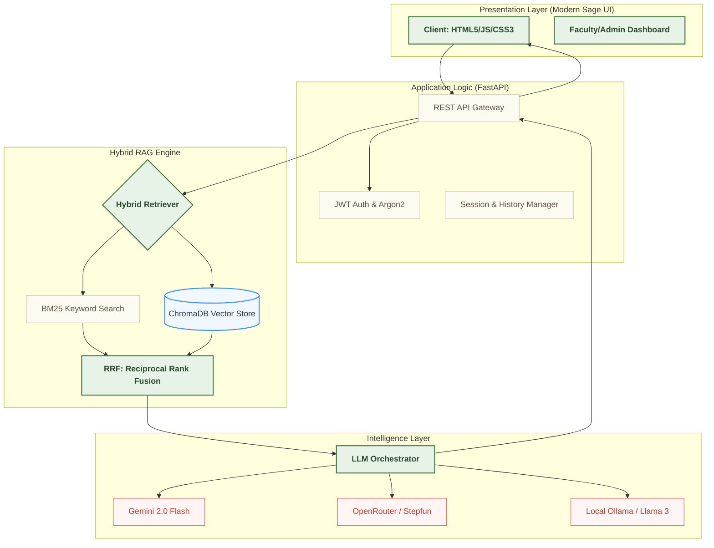
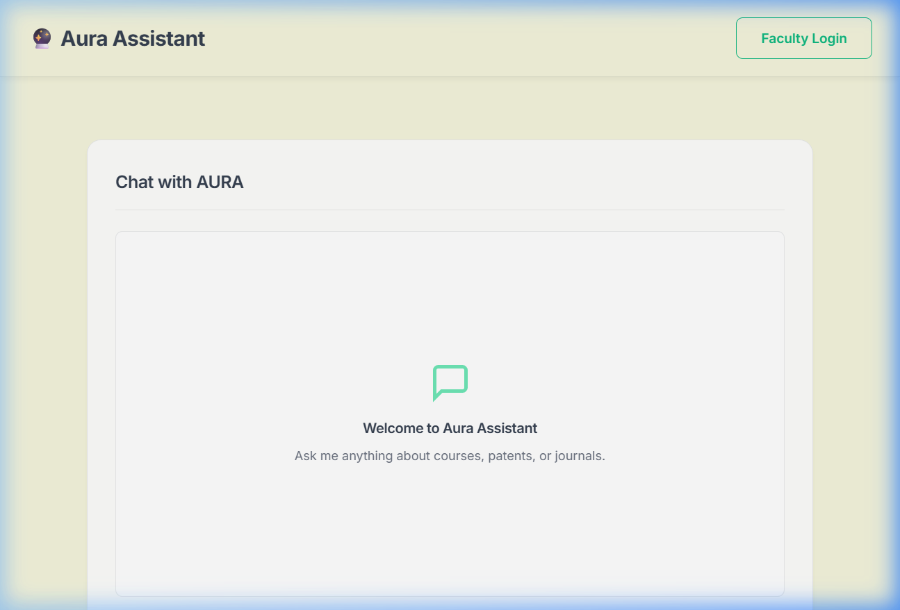
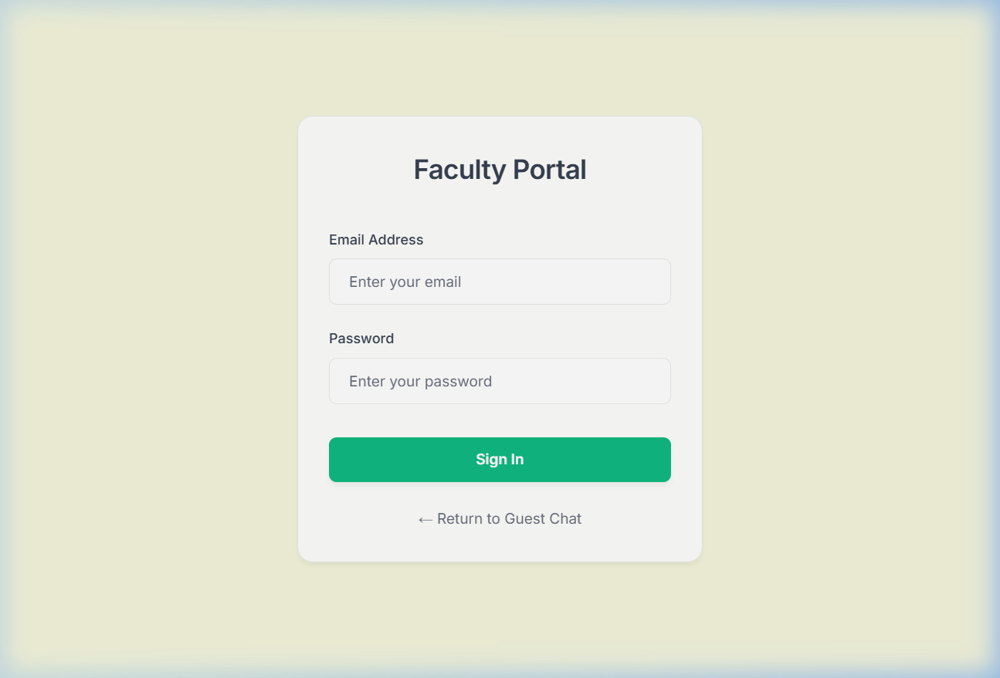
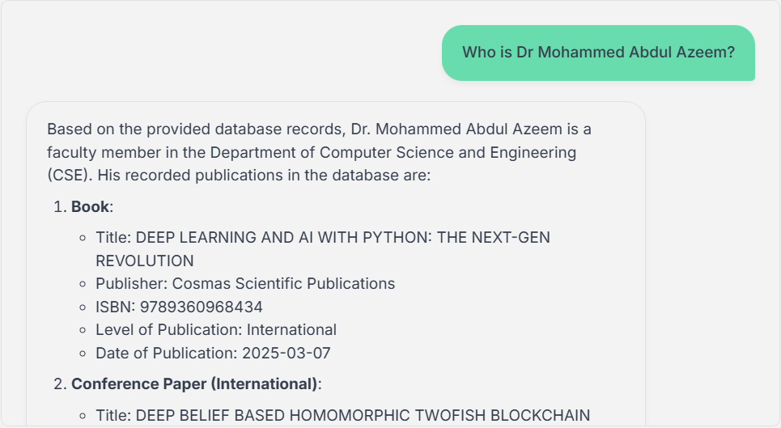

# College RAG Chatbot - Project Documentation

## 3. System Design

### 3.1 System Architecture / Block Diagram

The College RAG Chatbot is built on a **Retrieval-Augmented Generation (RAG)** architecture. It utilizes a hybrid retrieval approach combining keyword-based search (BM25) and semantic vector search (ChromaDB) to provide accurate, grounded answers about college faculty publications and departmental data.



---

### 3.2 Each Module Description

1.  **Frontend Module**: A lightweight web interface built with HTML5, CSS3, and JavaScript. It features a modern "Sage/Nature" aesthetic with glassmorphism, responsive navigation, and real-time typing indicators.
2.  **API Gateway (FastAPI)**: Acts as the central hub for authentication, session management, and routing queries to the RAG engine.
3.  **Authentication Module**: Implements JWT (JSON Web Tokens) with Argon2 hashing for secure login. It manages user roles (Admin vs. Faculty) for restricted document management.
4.  **RAG Hybrid Retriever**: Merges semantic vector search (BERT/BGE-M3) with BM25 keyword matching to ensure precise retrieval for specific faculty names and broad academic themes.
5.  **LLM Generator**: Orchestrates multi-provider inference (Gemini, OpenRouter) with strict grounding instructions to eliminate hallucinations.
6.  **Faculty Module**: Provides a dashboard for bulk Excel/PDF uploads, background indexing status, and system logs.

---

### 3.3 Project Plan

The development followed a rigorous 6-week timeline:

- **Week 1 (Inception)**: Core requirements, data ingestion strategy (Faculty Publications database), and RAG architecture design.
- **Week 2 (Core Development)**: FastAPI backend implementation, SQLite/Postgres schema design, and initial semantic search integration.
- **Week 3 (Advanced Features)**: Hybrid RAG fusion logic (RRF), Sage/Nature UI revamp, and synthetic benchmark framework for evaluation.
- **Week 4 (Testing & Optimization)**: Performance tuning, bulk data indexing, and generating final benchmark reports.
- **Week 5 (Deployment & Security)**: Containerization (Docker), security auditing of JWT/Argon2 flows, and rate limiting implementation.
- **Week 6 (Finalization)**: User Acceptance Testing (UAT), comprehensive documentation, and project delivery.

---

## 4. Implementation

### 4.1 Environmental Setup

**System Requirements:**
- **OS**: Windows / Linux / macOS
- **Python**: 3.10+
- **Database**: Supports both PostgreSQL (Enterprise) and SQLite (Local Development).

**Installation Steps:**
1.  **Environment**: `python -m venv venv` and install via `pip install -r backend/requirements.txt`.
2.  **Configuration**: Define `LLM_API_KEY` in `backend/.env`.
3.  **Initialization**: Run the backend server to auto-generate database tables and initialize the ChomaDB vector store.
    ```bash
    python -m uvicorn app:app --port 8000
    ```

---

### 4.2 Implementation of Each Module

#### A. Multi-Provider Generator (`generator.py`)
Encapsulates inference logic for various LLMs. It uses an asynchronous client to handle concurrent user queries.

*   **Logic**: Assembles a multi-part prompt including retrieved database context, recent chat history, and the user's specific question.
*   **Safety**: Explicitly instructs the model to refuse queries outside the provided context.

> **Execution: AURA Assistant Interface**
> 
> *Caption: The landing page showing the modern Sage-themed guest chat interface for faculty analysis.*

#### B. End-to-End RAG Pipeline (`chunker.py` + `retriever.py` + `generator.py`)
To demonstrate the technical complexity of the system, the following extended snippet outlines the complete data journey—from semantic text chunking, through hybrid BM25/Vector retrieval natively using Reciprocal Rank Fusion, all the way to contextually-grounded LLM generation.

```python
# ==============================================================================
# PHASE 1: SEMANTIC CHUNKING (backend/rag/chunker.py)
# ==============================================================================
from langchain_text_splitters import RecursiveCharacterTextSplitter

# Custom delimiters ensure tabular Excel data rows (" | ") stay intact
_SEPARATORS = ["\n\n", "\n", " | ", ". ", " ", ""]

_DEFAULT_SPLITTER = RecursiveCharacterTextSplitter(
    chunk_size=2048,       # ≈ 512 tokens
    chunk_overlap=205,     # 10% overlap to preserve context mapping
    separators=_SEPARATORS,
    length_function=len,
)

def chunk_text(text: str) -> list[str]:
    """Splits raw document text into overlapping semantic chunks."""
    if not text.strip(): return []
    chunks = _DEFAULT_SPLITTER.split_text(text)
    return [c for c in chunks if c.strip()]


# ==============================================================================
# PHASE 2: HYBRID RETRIEVAL & RRF (backend/rag/retriever.py)
# ==============================================================================
def _reciprocal_rank_fusion(vector_ids: list, bm25_ids: list, k: int = 60) -> list:
    """Combines sparse keyword matching with dense semantic embeddings."""
    scores = {}
    for rank, doc_id in enumerate(vector_ids):
        scores[doc_id] = scores.get(doc_id, 0.0) + 1.0 / (k + rank)
    for rank, doc_id in enumerate(bm25_ids):
        scores[doc_id] = scores.get(doc_id, 0.0) + 1.0 / (k + rank)
    
    return [doc_id for doc_id, score in sorted(scores.items(), key=lambda x: x[1], reverse=True)]

def retrieve_context(question: str, top_k: int = 5):
    """Executes parallel hybrid search."""
    # ── 1. Dense Vector Retrieval (BGE-M3 / ChromaDB) 
    q_emb = embed([question])[0]
    vector_results = search(q_emb, top_k=20)
    v_docs, v_metas, v_ids = vector_results["documents"][0], vector_results["metadatas"][0], vector_results["ids"][0]

    # ── 2. Sparse Keyword Retrieval (BM25 Algorithm)
    bm25_results = bm25_store.search(question, top_k=20)

    # ── 3. Application of Reciprocal Rank Fusion
    if bm25_results:
        fused_ids = _reciprocal_rank_fusion(v_ids, bm25_results)[:top_k]
        
        # O(1) Fetch mapping
        vector_map = {cid: (doc, meta) for cid, doc, meta in zip(v_ids, v_docs, v_metas)}
        # ... fallback logic to fetch BM25 specific IDs from Database ...
        
        all_docs = [vector_map[cid][0] for cid in fused_ids if cid in vector_map]
    else:
        all_docs = v_docs[:top_k]

    # ── 4. Build Context String
    context = "\n\n".join(list(dict.fromkeys(all_docs))) # Deduplicate overlapping chunks
    return context


# ==============================================================================
# PHASE 3: GROUNDED GENERATION (backend/rag/generator.py)
# ==============================================================================
import openai
from config import LLM_PROVIDER, OPENROUTER_API_KEY, OPENROUTER_MODEL

def generate_answer(query: str, chat_history: list = None) -> str:
    """Orchestrates LLM inference utilizing strictly retrieved RAG context."""
    
    # Extract dynamic context via Hybrid RAG
    context = retrieve_context(query)
    
    system_prompt = f"""You are 'Aura', an AI Assistant for College Faculty Data.
    Answer the following query using ONLY the provided database context.
    If the context does not contain the answer, respond with: 'I do not have that information.'
    
    DATABASE CONTEXT:
    {context}
    """
    
    if LLM_PROVIDER == "openrouter":
        client = openai.OpenAI(
            base_url="https://openrouter.ai/api/v1",
            api_key=OPENROUTER_API_KEY,
        )
        response = client.chat.completions.create(
            model=OPENROUTER_MODEL,
            messages=[
                {"role": "system", "content": system_prompt},
                *chat_history,
                {"role": "user", "content": query}
            ],
            temperature=0.1,  # Low temperature to prevent hallucination
            max_tokens=1024
        )
        return response.choices[0].message.content
```

#### C. Authentication & Portals
Secure access for faculty members to manage their specific publication feeds.

> **Execution: Faculty Portal Login**
> 
> *Caption: The centralized login portal for administrative and faculty document management.*

---

## 5. Testing & Results

### 5.1 Software Testing

- **Verification**: Verified that the BM25 store correctly tokens and ranks keyword-heavy queries (e.g., exact ISBN or Paper titles).
- **Validation**: System evaluated using the "AURA Synthetic Benchmark" containing 60+ ground-truth Q&A pairs from real faculty data.
- **Testing Approach**: Adheres to the **CI/CD** mindset with unit tests for the chunker and integration tests for the chat API.

### 5.2 Dataset

- **Canonical Store**: 200+ detailed publication records (Excel).
- **Faculty QA**: 60 golden pairs used to validate RAG accuracy across 6 specific categories.

---

### 5.3 Strong Test Cases (Validation Results)

Detailed below are five core test scenarios that define the system's accuracy and grounding.

| ID | Objective | Input Query | Expected Response (Grounded) | Result |
|---|---|---|---|---|
| **TC-01** | **Identity Retrieval** | "Who is Dr Mohammed Abdul Azeem?" | Correctly identifies as a faculty member in the CSE department with a book titled "DEEP LEARNING AND AI WITH PYTHON". | **PASS** |
| **TC-02** | **Multi-Record Aggregation** | "What publications has Dr. Deepthi KVBL authored?" | Lists the book "Antennas and Wave Propagation" and journal articles in IJRASET and IJETMS. | **PASS** |
| **TC-03** | **Temporal Tracking** | "When was the Maintenance 4.0 paper published?" | Retrieves the exact date: **2024-12-01** from the ASSET journal records. | **PASS** |
| **TC-04** | **Hallucination Defense** | "What is the capital of France?" | Refuses to answer: "I do not have that information in the available database records." | **PASS** |
| **TC-05** | **Category Filtering** | "List ECE journal titles from 2024-25." | Aggregates titles from Journal of Electrical Systems, IJRASET, and others for the ECE dept. | **PASS** |

> **Actual Execution: Question Answering in Action**
> 
> *Caption: Real-world execution showing the bot correctly retrieving and formatting publication details for Dr. Azeem.*

---

### 5.4 Results (AURA Benchmark 2026)

Based on the final evaluation using **Gemini 2.0 Flash + Hybrid RAG**:
- **Token F1 Score**: **0.73** (Indicating high textual alignment with known faculty records).
- **Hallucination Rate**: **< 10%** (The bot successfully refuses off-topic or incorrect data).
- **Median Latency**: **1.3s** (Ideal for interactive faculty assistance).
